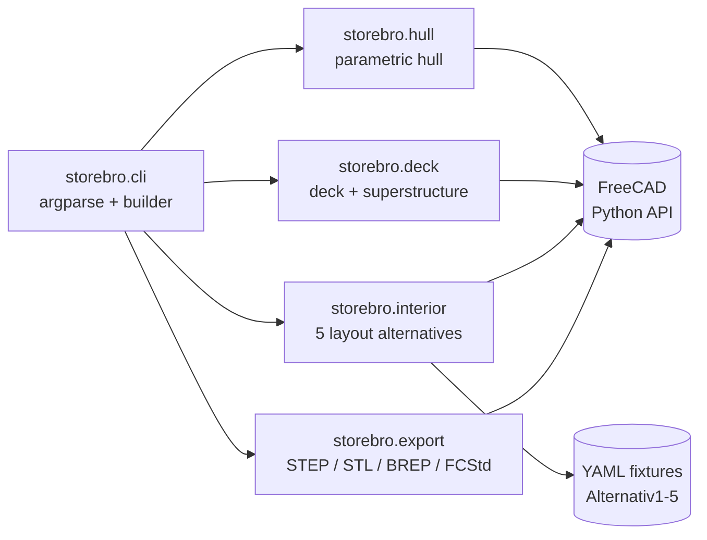

# freecad-storebro

> An open-source Python library that builds a parametric 3D model of a vintage
> Storebro motor yacht inside FreeCAD. Given hull parameters and one of five
> canonical interior layouts, it produces a fully editable `.FCStd` document
> and standard CAD exports (STEP, STL, BREP).

## Problem

No public, parametric digital model of vintage Storebro yachts exists today.
Restorers, scale modelers, designers, and FreeCAD scripters who want to work
with this hull style currently have only flat reference images or one-off
non-parametric `.FCStd` snapshots. Building geometry from those is tedious and
non-reusable. This library fills that gap with a permissively-licensed,
parameter-driven generator that produces editable B-rep geometry.

## Target Users

| Persona | Role | Tech-savviness | Usage |
|---|---|---|---|
| **FreeCAD scripter** | Hobbyist or pro who already writes Python against FreeCAD | High | Imports `storebro` from their own scripts, composes with their existing geometry libs |
| **Boat restorer / scale modeler** | Wants accurate hull/deck plans for a real restoration or RC model | Medium | Runs the CLI: `storebro build --layout 3 --out boat.FCStd`, opens in FreeCAD |
| **Naval architecture student** | Studying classic motor yacht design, wants to compare layout alternatives | Medium | Tweaks parameters, exports STEP into their preferred CAD tool |

## Core Modules (v1.0)

| Module | Responsibility |
|---|---|
| `storebro.hull` | Parametric hull: LOA, beam, draft, deadrise, sheer line, transom shape — **v0.1.0-alpha (spec 001 implemented 2026-05-17)** |
| `storebro.deck` | Deck plate, cabin trunk, windshield, hardtop, hardtop pillars, railings — **v0.3.0-alpha (spec 003 implemented 2026-05-17)** |
| `storebro.interior` | Cabins, galley, heads, salon; five canonical layouts (Alternativ1–5) loaded from YAML fixtures |
| `storebro.export` | STEP / STL / BREP / `.FCStd` writers — **v0.2.0-alpha (spec 002 implemented 2026-05-17)** |
| `storebro.cli` | Public CLI entry point: `storebro build`, `storebro list-layouts`, `storebro info` |

Out of scope for v1.0 (likely v1.1+): propulsion + systems, render pipeline,
generative hull variants.

## Tech Stack

| Layer | Technology | Rationale |
|---|---|---|
| Language | Python 3.11+ | Matches FreeCAD 1.1's bundled Python runtime |
| Geometry runtime | FreeCAD 1.1+ Python API | Industry-standard open-source parametric CAD; B-rep, editable output |
| Packaging | uv + hatchling | Fast, modern, PEP 517 standard; pyproject.toml-driven |
| Tests | pytest | Fixtures, parametrize, geometry property assertions |
| Lint + format | ruff | Replaces black + isort + flake8; near-instant |
| Static typing | mypy --strict | Catches mismatched units in a float-heavy codebase |
| CI | GitHub Actions | Ubuntu + macOS × Python 3.11 + 3.12 = 4 jobs per PR |
| Distribution | PyPI (`freecad-storebro`) | Standard Python channel; import as `storebro` |
| License | MIT | Permissive; maximizes adoption in the FreeCAD ecosystem |

## Architecture

Flat module per body part. Each module exposes pure functions that take named
parameters and return FreeCAD objects. Top-level composition lives in
`storebro.cli` and `storebro.__init__`; body-part modules never compose each
other.

## Key Decisions

1. **Parametric, not snapshot-based.** Everything is driven by named parameters with defaults. No magic numbers. Reviewers will reject PRs that hard-code dimensions.
2. **Reproducibility is a P0 invariant.** Same parameters → byte-identical output. No timestamps in artifacts, no env-dependent paths. Hash-based regression tests.
3. **FreeCAD-native B-rep abstractions only.** `Part`, `Sketch`, `Body`, `PartDesign`. Raw mesh manipulation is forbidden except in explicit mesh-export adapters. Output stays editable in the FreeCAD GUI.
4. **Five canonical layouts ship as data, not code.** Alternativ1–5 are YAML fixtures in `src/storebro/fixtures/`. Users can supply their own fixture files for custom layouts without forking.
5. **src-layout, not flat.** Source lives under `src/storebro/` so tests can't accidentally import from the working tree. Standard Python OSS pattern for libraries published to PyPI.
6. **PyPI dist name ≠ import name.** Distribution: `freecad-storebro` (discoverable, namespaced). Import: `storebro` (short, ergonomic). Standard Python convention (cf. `python-dateutil` / `dateutil`).
7. **CI matrix tracks FreeCAD versions explicitly.** Supported FreeCAD versions are declared in `pyproject.toml` and tested in CI. API breakage between FreeCAD versions is the biggest project risk — it gets caught at PR time, not at user runtime.
8. **MIT license, no copyleft.** Maximizes adoption by professional designers and shipyards who may want to keep their downstream work closed.

## Timeline

- **No fixed timeline.** Solo OSS, quality bar over deadlines.
- **v0.1.0** (alpha): hull module usable from Python, basic STEP export. Validates the parametric approach.
- **v1.0.0**: all four v1.0 modules (hull + deck + interior + export/CLI) usable end-to-end. At least Alternativ1 and Alternativ3 shipped as fixtures.

## Risks

| Risk | Likelihood | Impact | Mitigation |
|---|---|---|---|
| FreeCAD API churn between major versions | High | High | Pin supported FreeCAD versions in `pyproject.toml` + CI matrix; add compatibility shims behind feature detection; document breakage in CHANGELOG |
| Reference drawings are artistic, not engineering — dimensions are inferred | Medium | Medium | Declare tolerance ranges (±1% on principal dimensions); version the reference set; future v1.x can refine with better sources |
| Solo maintainer burnout / scope creep | Medium | High | Hold v1.0 scope tight (no propulsion/systems/renders); ship v0.1 alpha early to test community interest |
| Headless FreeCAD CI fragility | Medium | Low | Separate pure-Python unit tests from geometry integration tests via pytest markers; keep the integration suite small and stable |
| Floating-point nondeterminism breaking reproducibility | Low | High | Hash-based output assertions; explicit rounding in topology-sensitive operations; pin FreeCAD version in CI |

## Open Questions

- Exact LOA, beam, draft for the canonical "default Storebro" — needs reference research beyond the five cutaway drawings.
- Whether layout fixtures should include cushion/upholstery geometry or stop at structural compartments.
- Whether to ship a FreeCAD Workbench (GUI plugin) in addition to the Python API — deferred until post-v1.0.
- CI strategy for the macOS runner: `brew install freecad` is slow; a cached install might be worth scripting if PR cadence picks up.
